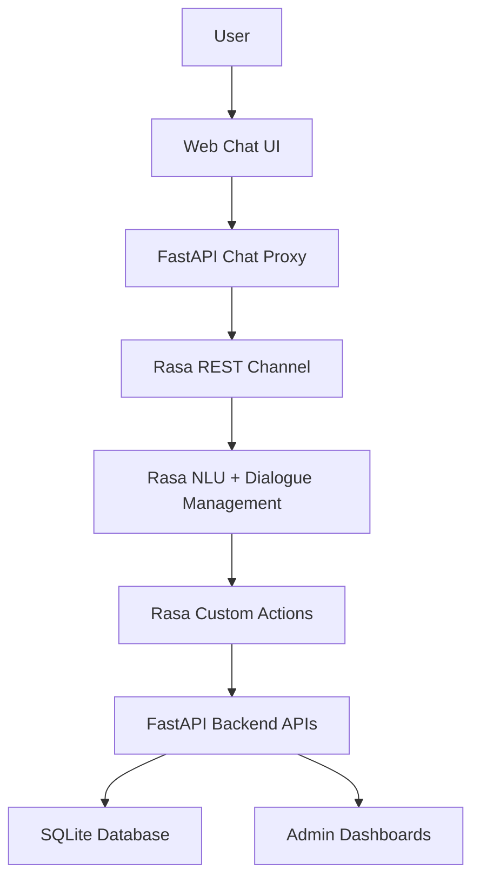
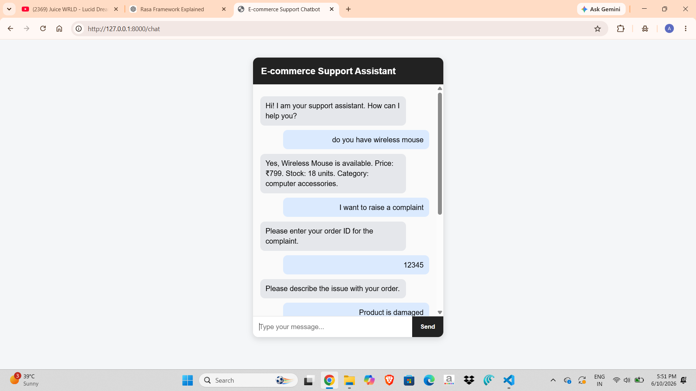
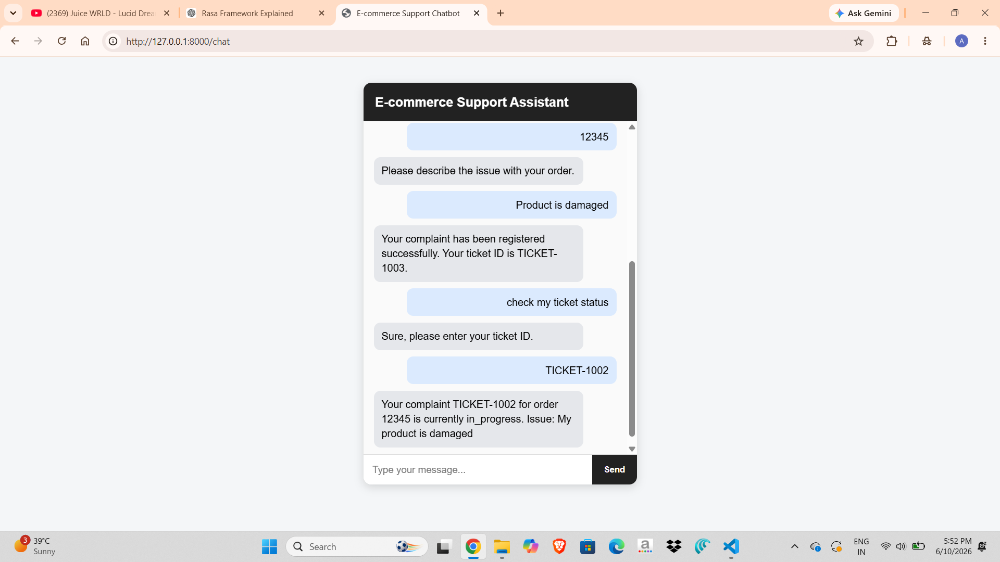
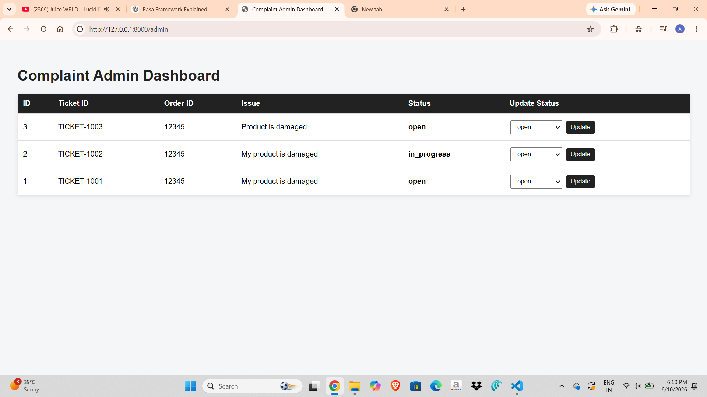
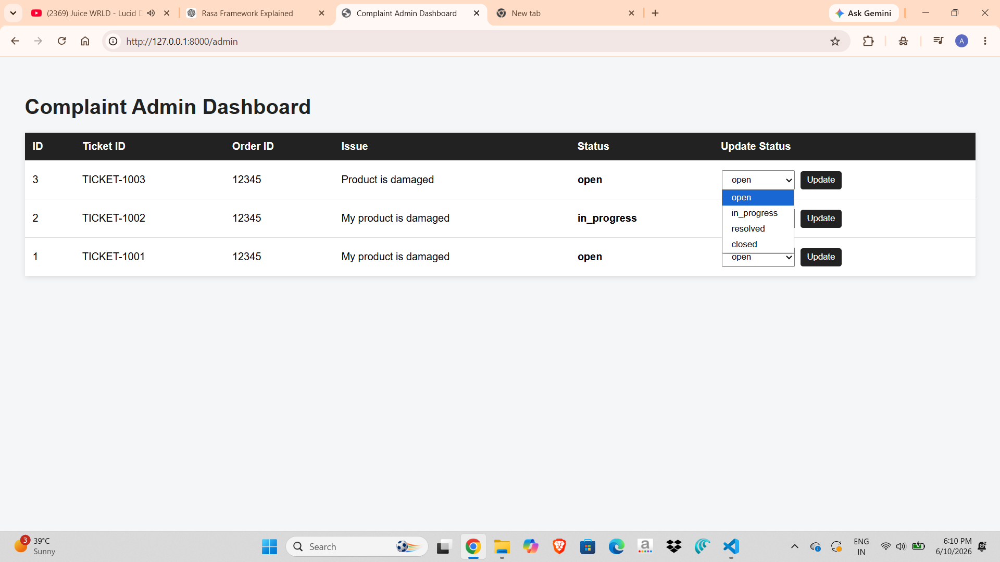
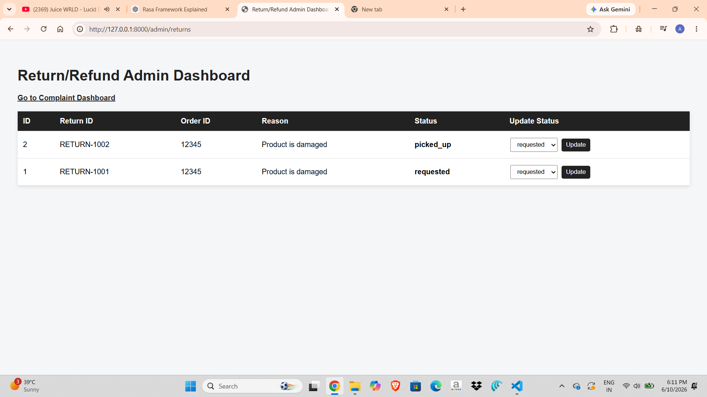
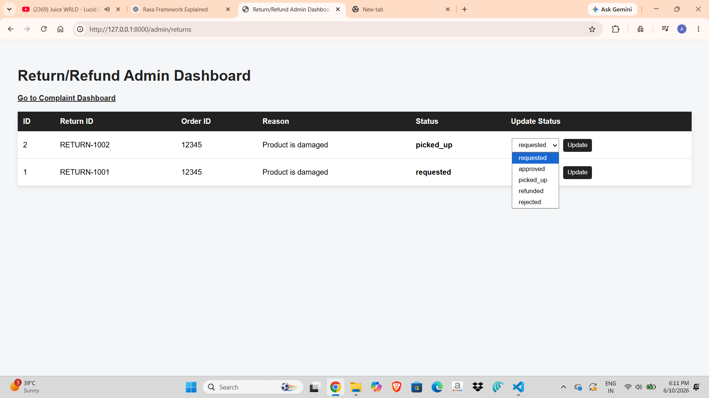
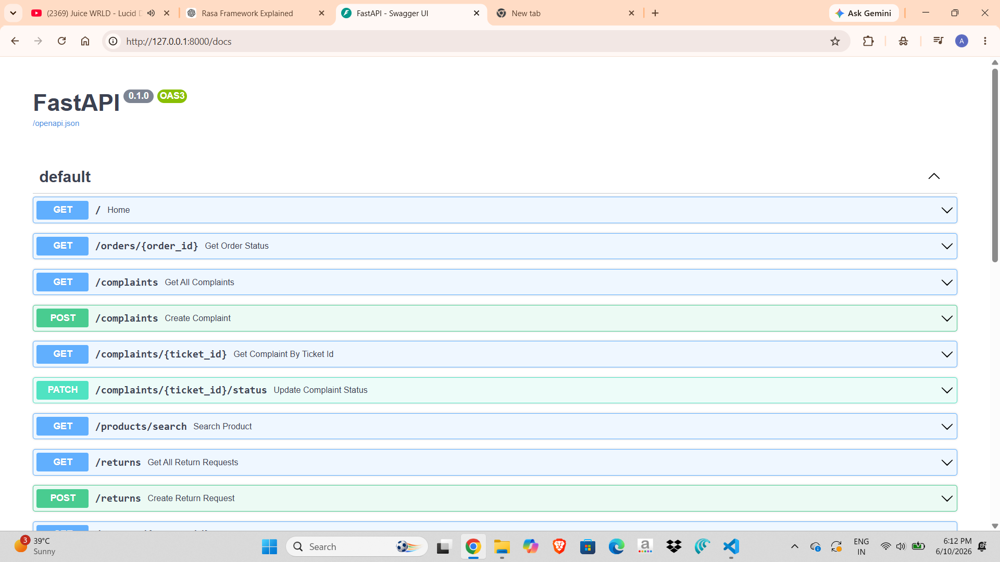
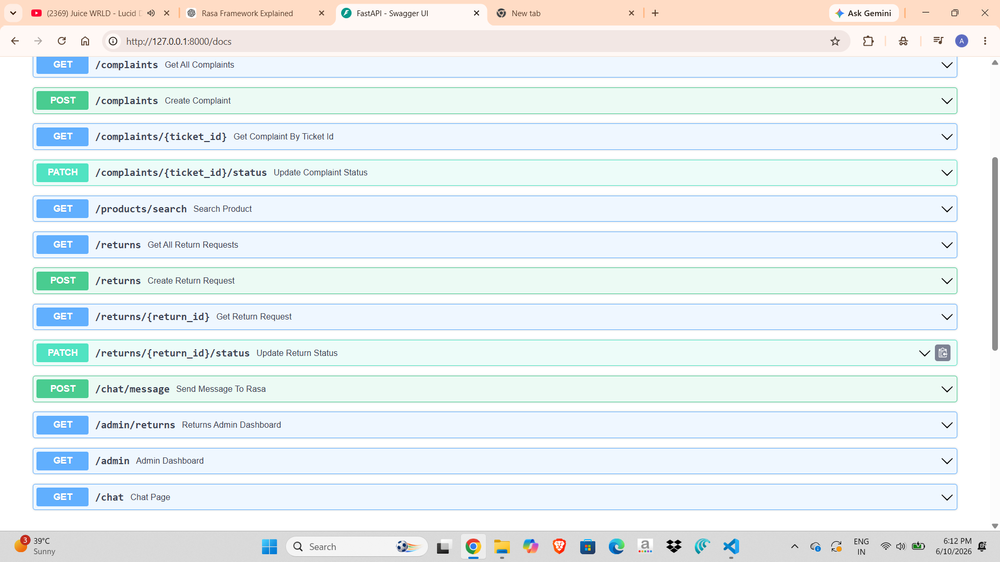
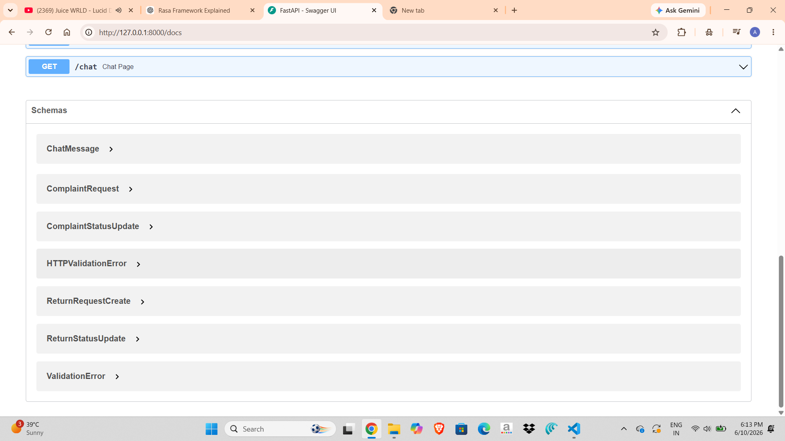

# Rasa E-commerce Customer Support Bot

A full-stack conversational AI assistant for e-commerce customer support, built with **Rasa Open Source**, **FastAPI**, and **SQLite**.

The assistant supports common customer-service flows such as order tracking, product enquiry, complaint registration, ticket status tracking, return/refund requests, admin status updates, and browser-based web chat.

---

## Table of Contents

- [Features](#features)
- [Tech Stack](#tech-stack)
- [Project Architecture](#project-architecture)
- [Screenshots](#screenshots)
- [Main User Flows](#main-user-flows)
- [API Endpoints](#api-endpoints)
- [How to Run Locally](#how-to-run-locally)
- [Admin Dashboards](#admin-dashboards)
- [Project Structure](#project-structure)
- [Future Improvements](#future-improvements)

---

## Features

- Order status tracking
- Product enquiry with price, stock, and category details
- Complaint registration with ticket ID generation
- Complaint status tracking
- Admin complaint dashboard
- Complaint status update by admin
- Return/refund request creation
- Return/refund status tracking
- Admin return/refund dashboard
- Return/refund status update by admin
- SQLite-based persistent storage
- FastAPI backend APIs
- Rasa custom actions
- Browser-based web chat interface using Rasa REST channel
- SQLite-based order storage
- SQLite-based product catalog storage
- Admin order management dashboard
- Admin product management dashboard
- Basic admin authentication for dashboard access

---

## Tech Stack

| Layer | Technology |
|---|---|
| Conversational AI | Rasa Open Source |
| Custom Actions | Rasa SDK |
| Backend API | FastAPI |
| Database | SQLite |
| Language | Python |
| Frontend | HTML, CSS, JavaScript |
| Communication | REST API |
| Testing UI | FastAPI Swagger Docs, Web Chat UI |

---

## Project Architecture



### Architecture Explanation

The user sends messages through the web chat interface.  
The FastAPI chat endpoint forwards those messages to the Rasa REST channel.  
Rasa predicts the user intent, extracts entities, manages conversation flow, and triggers custom actions when needed.  
Custom actions call FastAPI backend APIs for order tracking, product enquiry, complaint handling, and return/refund handling.  
FastAPI stores complaint and return/refund data in SQLite and provides admin dashboards for status updates.

---

## Screenshots

> Create a folder named `screenshots` in the root of your project and save your screenshots using the exact filenames below.

### OUTPUTS



















---

## Main User Flows

### 1. Order Tracking

```text
User: track my order
Bot: Sure, please enter your order ID.
User: 12345
Bot: Your order 12345 is currently out for delivery. Expected delivery: today by 8 PM.
```

### 2. Product Enquiry

```text
User: do you have wireless mouse
Bot: Yes, Wireless Mouse is available. Price: ₹799. Stock: 18 units. Category: computer accessories.
```

### 3. Complaint Registration

```text
User: I want to raise a complaint
Bot: Please enter your order ID for the complaint.
User: 12345
Bot: Please describe the issue with your order.
User: My product is damaged
Bot: Your complaint has been registered successfully. Your ticket ID is TICKET-1001.
```

### 4. Complaint Status Tracking

```text
User: check my ticket status
Bot: Sure, please enter your ticket ID.
User: TICKET-1001
Bot: Your complaint TICKET-1001 for order 12345 is currently open. Issue: My product is damaged.
```

### 5. Return/Refund Request

```text
User: I want to return my order
Bot: Please enter your order ID for the return/refund request.
User: 12345
Bot: Please tell me the reason for return or refund.
User: Product is damaged
Bot: Your return/refund request has been created successfully. Your return ID is RETURN-1001.
```

### 6. Return/Refund Status Tracking

```text
User: check my return status
Bot: Sure, please enter your return/refund ID.
User: RETURN-1001
Bot: Your return/refund request RETURN-1001 for order 12345 is currently requested. Reason: Product is damaged.
```

---

## API Endpoints

| Method | Endpoint | Purpose |
|---|---|---|
| `GET` | `/` | Backend health check |
| `GET` | `/orders/{order_id}` | Get order status |
| `GET` | `/products/search?q=product_name` | Search product details |
| `POST` | `/complaints` | Create complaint ticket |
| `GET` | `/complaints` | Get all complaints |
| `GET` | `/complaints/{ticket_id}` | Get complaint status |
| `PATCH` | `/complaints/{ticket_id}/status` | Update complaint status |
| `POST` | `/returns` | Create return/refund request |
| `GET` | `/returns` | Get all return/refund requests |
| `GET` | `/returns/{return_id}` | Get return/refund status |
| `PATCH` | `/returns/{return_id}/status` | Update return/refund status |
| `GET` | `/admin` | Complaint admin dashboard |
| `GET` | `/admin/returns` | Return/refund admin dashboard |
| `GET` | `/chat` | Browser-based chat UI |
| `POST` | `/chat/message` | Send chat message to Rasa |
| `GET` | `/orders` | Get all orders |
| `PATCH` | `/orders/{order_id}` | Update order status and expected delivery |
| `GET` | `/products` | Get all products |
| `PATCH` | `/products/{product_id}` | Update product details |
| `GET` | `/admin/orders` | Order admin dashboard |
| `GET` | `/admin/products` | Product admin dashboard |

---

## How to Run Locally

### 1. Clone the repository

```bash
git clone <your-repository-url>
cd rasa-ecommerce-support-bot
```

### 2. Create a virtual environment

```bash
python -m venv .venv
```

### 3. Activate the virtual environment

For Windows PowerShell:

```powershell
.venv\Scripts\activate
```

For macOS/Linux:

```bash
source .venv/bin/activate
```

### 4. Install dependencies

```bash
pip install -r requirements.txt
```

### 5. Train the Rasa model

```bash
rasa train
```

### 6. Run the FastAPI backend

Open terminal 1:

```bash
uvicorn backend:app --reload
```

Backend will run at:

```text
http://127.0.0.1:8000
```

### 7. Run the Rasa action server

Open terminal 2:

```bash
rasa run actions
```

Action server will run at:

```text
http://127.0.0.1:5055
```

### 8. Run the Rasa bot server

Open terminal 3:

```bash
rasa run --enable-api --cors "*"
```

Rasa server will run at:

```text
http://127.0.0.1:5005
```

### 9. Open the web chat

Open this URL in your browser:

```text
http://127.0.0.1:8000/chat
```

---

## Admin Dashboards

Complaint dashboard:

```text
http://127.0.0.1:8000/admin
```

Return/refund dashboard:

```text
http://127.0.0.1:8000/admin/returns
```

FastAPI Swagger documentation:

```text
http://127.0.0.1:8000/docs
```

Admin dashboard routes are protected with HTTP Basic Authentication.

Default local credentials:

```text
Username: admin
Password: admin123
```
---

## Project Structure

```text
rasa-ecommerce-support-bot/
│
├── actions/
│   └── actions.py
│
├── data/
│   ├── nlu.yml
│   ├── rules.yml
│   └── stories.yml
│
├── screenshots/
│
├── backend.py
├── config.yml
├── credentials.yml
├── domain.yml
├── endpoints.yml
├── requirements.txt
├── README.md
└── .gitignore
```

---

## Suggested `.gitignore`

```gitignore
.venv/
__pycache__/
*.pyc
.rasa/
.cache/
models/
*.db
*.log
.env
.DS_Store
```

---

## Resume Description

**Rasa E-commerce Customer Support Bot**  
Built a full-stack conversational AI assistant using Rasa, FastAPI, SQLite, and REST APIs. The system supports order tracking, product enquiry, complaint registration, ticket status tracking, return/refund handling, admin dashboards, and browser-based web chat integration.

### Resume Bullet Points

- Developed a Rasa-based conversational AI assistant with intent classification, entity extraction, slots, forms, stories, rules, and custom actions.
- Integrated FastAPI backend APIs with Rasa custom actions for order tracking, product enquiry, complaint handling, and return/refund management.
- Implemented SQLite-based persistent storage for complaints and return/refund requests.
- Built admin dashboards for complaint and return/refund status updates.
- Added a browser-based web chat interface using Rasa REST channel integration.

---

## Future Improvements

- Replace SQLite with PostgreSQL for production-level database support
- Replace Basic Auth with JWT-based role-based authentication
- Add Docker and Docker Compose support
- Add React or Next.js frontend for a professional UI
- Add analytics dashboard for complaints, returns, and product enquiries
- Add email/SMS notification for ticket and return/refund updates
- Add live human handoff for unresolved customer queries
- Add logging and monitoring for chatbot conversations
- Deploy backend, Rasa server, and admin dashboards online

---

## Author - Ayush Kumar Maurya

Developed as a practical conversational AI project using Rasa, FastAPI, and SQLite.
