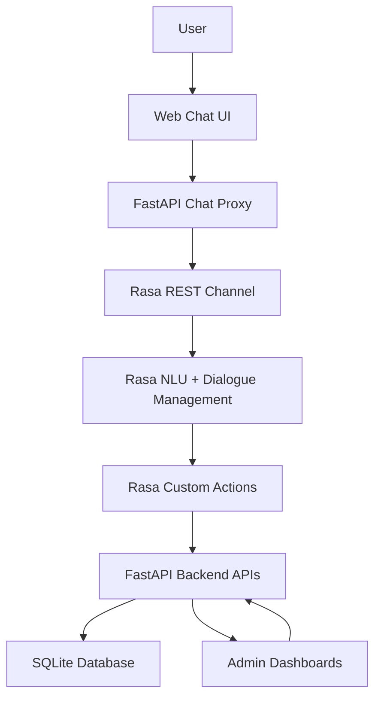

# Rasa E-commerce Customer Support Bot

A full-stack conversational AI assistant for e-commerce customer support, built with **Rasa Open Source**, **FastAPI**, **SQLite**, **Rasa SDK**, and **Docker Compose**.

The assistant supports common customer-service flows such as order tracking, product enquiry, complaint registration, complaint status tracking, return/refund requests, return/refund status tracking, admin-side status updates, browser-based web chat, and protected admin dashboards.

---

## Table of Contents

- [Features](#features)
- [Tech Stack](#tech-stack)
- [Project Architecture](#project-architecture)
- [Screenshots](#screenshots)
- [Main User Flows](#main-user-flows)
- [API Endpoints](#api-endpoints)
- [Environment Variables](#environment-variables)
- [How to Run Locally](#how-to-run-locally)
- [Run with Docker](#run-with-docker)
- [Admin Dashboards](#admin-dashboards)
- [Project Structure](#project-structure)
- [Suggested `.gitignore`](#suggested-gitignore)
- [Resume Description](#resume-description)
- [Future Improvements](#future-improvements)
- [Author](#author)

---

## Features

- Order status tracking
- Product enquiry with price, stock, and category details
- Complaint registration with ticket ID generation
- Complaint status tracking
- Return/refund request creation
- Return/refund status tracking
- Admin complaint dashboard
- Admin return/refund dashboard
- Admin order management dashboard
- Admin product management dashboard
- Complaint status update by admin
- Return/refund status update by admin
- Order status and expected delivery update by admin
- Product price, stock, name, and category update by admin
- SQLite-based persistent storage
- SQLite-based order storage
- SQLite-based product catalog storage
- SQLite-based complaint storage
- SQLite-based return/refund storage
- Created and updated timestamps for database records
- Status history tracking for orders, complaints, and return/refund requests
- FastAPI backend APIs
- Rasa custom actions
- Browser-based web chat interface using Rasa REST channel
- Basic admin authentication for dashboard access
- Environment-based configuration for admin credentials and service URLs
- Docker and Docker Compose support
- Separate optimized Docker images for backend, action server, and Rasa server

---

## Tech Stack

| Layer | Technology |
|---|---|
| Conversational AI | Rasa Open Source |
| Custom Actions | Rasa SDK |
| Backend API | FastAPI |
| Database | SQLite |
| Language | Python |
| Admin UI | HTML, CSS, JavaScript |
| Chat UI | HTML, CSS, JavaScript |
| Communication | REST API |
| Containerization | Docker, Docker Compose |
| Configuration | `.env`, `python-dotenv` |
| Testing UI | FastAPI Swagger Docs, Web Chat UI |

---

## Project Architecture



### Architecture Explanation

The user sends messages through the web chat interface.  
The FastAPI chat endpoint forwards those messages to the Rasa REST channel.  
Rasa predicts the user intent, extracts entities, manages conversation flow, and triggers custom actions when needed.  
Custom actions call FastAPI backend APIs for order tracking, product enquiry, complaint handling, and return/refund handling.  
FastAPI stores and fetches data from SQLite. Admin dashboards allow protected status and catalog updates.

### Docker Architecture

The project uses separate Docker images for each service:

- `Dockerfile.backend` for the FastAPI backend
- `Dockerfile.actions` for the Rasa custom action server
- `Dockerfile.rasa` for the Rasa chatbot server

This avoids installing full Rasa and TensorFlow inside every container and keeps the backend image lightweight.

---

## Screenshots

> Keep all screenshots inside the `screenshots/` folder.  
> If your screenshot filenames contain spaces, use `%20` in Markdown links.

### Project Outputs


### Recommended Additional Screenshots

Add these later if available:

```text
screenshots/docker-containers-running.png
screenshots/docker-web-chat-working.png
screenshots/admin-order-dashboard.png
screenshots/admin-product-dashboard.png
screenshots/status-history-api.png
```

---

## Main User Flows

### 1. Order Tracking

```text
User: track my order
Bot: Sure, please enter your order ID.
User: 12345
Bot: Your order 12345 is currently out for delivery. Expected delivery: today by 8 PM.
```

### 2. Product Enquiry

```text
User: do you have wireless mouse
Bot: Yes, Wireless Mouse is available. Price: ₹799. Stock: 18 units. Category: computer accessories.
```

### 3. Complaint Registration

```text
User: I want to raise a complaint
Bot: Please enter your order ID for the complaint.
User: 12345
Bot: Please describe the issue with your order.
User: My product is damaged
Bot: Your complaint has been registered successfully. Your ticket ID is TICKET-1001.
```

### 4. Complaint Status Tracking

```text
User: check my ticket status
Bot: Sure, please enter your ticket ID.
User: TICKET-1001
Bot: Your complaint TICKET-1001 for order 12345 is currently open. Issue: My product is damaged.
```

### 5. Return/Refund Request

```text
User: I want to return my order
Bot: Please enter your order ID for the return/refund request.
User: 12345
Bot: Please tell me the reason for return or refund.
User: Product is damaged
Bot: Your return/refund request has been created successfully. Your return ID is RETURN-1001.
```

### 6. Return/Refund Status Tracking

```text
User: check my return status
Bot: Sure, please enter your return/refund ID.
User: RETURN-1001
Bot: Your return/refund request RETURN-1001 for order 12345 is currently requested. Reason: Product is damaged.
```

### 7. Admin Product Update

```text
Admin opens product dashboard.
Admin updates product stock from 18 to 0.
User: do you have wireless mouse
Bot: Wireless Mouse is currently out of stock. Price: ₹799. Category: computer accessories.
```

### 8. Admin Order Update

```text
Admin opens order dashboard.
Admin changes order 12345 status to delivered.
User: track my order
User: 12345
Bot: Your order 12345 is currently delivered. Expected delivery: already delivered.
```

---

## API Endpoints

| Method | Endpoint | Purpose |
|---|---|---|
| `GET` | `/` | Backend health check |
| `GET` | `/orders` | Get all orders |
| `GET` | `/orders/{order_id}` | Get order status |
| `PATCH` | `/orders/{order_id}` | Update order status and expected delivery |
| `GET` | `/orders/{order_id}/history` | Get order status history |
| `GET` | `/products` | Get all products |
| `GET` | `/products/search?q=product_name` | Search product details |
| `PATCH` | `/products/{product_id}` | Update product details |
| `POST` | `/complaints` | Create complaint ticket |
| `GET` | `/complaints` | Get all complaints |
| `GET` | `/complaints/{ticket_id}` | Get complaint status |
| `PATCH` | `/complaints/{ticket_id}/status` | Update complaint status |
| `GET` | `/complaints/{ticket_id}/history` | Get complaint status history |
| `POST` | `/returns` | Create return/refund request |
| `GET` | `/returns` | Get all return/refund requests |
| `GET` | `/returns/{return_id}` | Get return/refund status |
| `PATCH` | `/returns/{return_id}/status` | Update return/refund status |
| `GET` | `/returns/{return_id}/history` | Get return/refund status history |
| `GET` | `/admin` | Complaint admin dashboard |
| `GET` | `/admin/returns` | Return/refund admin dashboard |
| `GET` | `/admin/orders` | Order admin dashboard |
| `GET` | `/admin/products` | Product admin dashboard |
| `GET` | `/chat` | Browser-based chat UI |
| `POST` | `/chat/message` | Send chat message to Rasa |
| `GET` | `/docs` | FastAPI Swagger documentation |

---

## Environment Variables

Create a `.env` file in the project root:

```env
ADMIN_USERNAME=admin
ADMIN_PASSWORD=admin123
BACKEND_BASE_URL=http://127.0.0.1:8000
RASA_SERVER_URL=http://127.0.0.1:5005
DATABASE_NAME=complaints.db
```

For GitHub, use `.env.example` as a reference. Do not commit the real `.env` file.

Example `.env.example`:

```env
ADMIN_USERNAME=admin
ADMIN_PASSWORD=change-this-password
BACKEND_BASE_URL=http://127.0.0.1:8000
RASA_SERVER_URL=http://127.0.0.1:5005
DATABASE_NAME=complaints.db
```

---

## How to Run Locally

### 1. Clone the repository

```bash
git clone <your-repository-url>
cd rasa-ecommerce-support-bot
```

### 2. Create a virtual environment

```bash
python -m venv .venv
```

### 3. Activate the virtual environment

For Windows PowerShell:

```powershell
.venv\Scriptsctivate
```

For macOS/Linux:

```bash
source .venv/bin/activate
```

### 4. Install dependencies

```bash
pip install -r requirements.txt
```

### 5. Train the Rasa model

```bash
rasa train
```

### 6. Run the FastAPI backend

Open terminal 1:

```bash
uvicorn backend:app --reload
```

Backend will run at:

```text
http://127.0.0.1:8000
```

### 7. Run the Rasa action server

Open terminal 2:

```bash
rasa run actions
```

Action server will run at:

```text
http://127.0.0.1:5055
```

### 8. Run the Rasa bot server

Open terminal 3:

```bash
rasa run --enable-api --cors "*"
```

Rasa server will run at:

```text
http://127.0.0.1:5005
```

### 9. Open the web chat

Open this URL in your browser:

```text
http://127.0.0.1:8000/chat
```

---

## Run with Docker

Make sure Docker Desktop is running.

### Build and start all services

```bash
docker compose up --build
```

### Open the web chat

```text
http://127.0.0.1:8000/chat
```

### Open admin dashboards

```text
http://127.0.0.1:8000/admin
http://127.0.0.1:8000/admin/products
http://127.0.0.1:8000/admin/orders
http://127.0.0.1:8000/admin/returns
```

### Default local admin credentials

```text
Username: admin
Password: admin123
```

### Stop containers

```bash
docker compose down
```

### Rebuild only one service

```bash
docker compose build backend --no-cache
docker compose build actions --no-cache
docker compose build rasa --no-cache
```

### View logs

```bash
docker compose logs -f
docker compose logs -f backend
docker compose logs -f actions
docker compose logs -f rasa
```

---

## Admin Dashboards

Complaint dashboard:

```text
http://127.0.0.1:8000/admin
```

Return/refund dashboard:

```text
http://127.0.0.1:8000/admin/returns
```

Order dashboard:

```text
http://127.0.0.1:8000/admin/orders
```

Product dashboard:

```text
http://127.0.0.1:8000/admin/products
```

FastAPI Swagger documentation:

```text
http://127.0.0.1:8000/docs
```

Admin dashboard routes are protected with HTTP Basic Authentication.

Default local credentials:

```text
Username: admin
Password: admin123
```

> These credentials are for local development only. In production, credentials should be stored securely and authentication should be upgraded to JWT or session-based login.

---

## Project Structure

```text
rasa-ecommerce-support-bot/
│
├── actions/
│   └── actions.py
│
├── data/
│   ├── nlu.yml
│   ├── rules.yml
│   └── stories.yml
│
├── screenshots/
│
├── storage/
│   └── complaints.db              # Local Docker database, ignored by Git
│
├── backend.py
├── config.yml
├── credentials.yml
├── domain.yml
├── endpoints.yml
├── endpoints.docker.yml
├── docker-compose.yml
├── Dockerfile.backend
├── Dockerfile.actions
├── Dockerfile.rasa
├── requirements.txt
├── requirements-backend.txt
├── requirements-actions.txt
├── requirements-rasa.txt
├── .env.example
├── .dockerignore
├── .gitignore
└── README.md
```

---

## Suggested `.gitignore`

```gitignore
.venv/
__pycache__/
*.pyc
.rasa/
.cache/
models/
*.db
*.log
.env
.DS_Store
storage/
```

---

## Resume Description

**Rasa E-commerce Customer Support Bot**  
Built a full-stack conversational AI assistant using Rasa, FastAPI, SQLite, REST APIs, and Docker Compose. The system supports order tracking, product enquiry, complaint registration, ticket status tracking, return/refund handling, protected admin dashboards, browser-based web chat integration, database-backed product/order storage, and status-history tracking.

### Resume Bullet Points

- Developed a Rasa-based conversational AI assistant with intent classification, entity extraction, slots, forms, stories, rules, and custom actions.
- Integrated FastAPI backend APIs with Rasa custom actions for order tracking, product enquiry, complaint handling, and return/refund management.
- Implemented SQLite-based persistent storage for products, orders, complaints, and return/refund requests.
- Added created/updated timestamps and status-history tracking for orders, complaints, and return/refund requests.
- Built protected admin dashboards for complaint, return/refund, order, and product management.
- Added a browser-based web chat interface using Rasa REST channel integration.
- Dockerized the project using separate service images for backend, action server, and Rasa server.

---

## Future Improvements

- Replace SQLite with PostgreSQL for production-level database support
- Replace raw `sqlite3` queries with SQLAlchemy ORM
- Replace Basic Auth with JWT-based role-based authentication
- Add a dedicated React or Next.js frontend for a professional UI
- Improve fallback handling for unclear and out-of-scope user messages
- Add analytics dashboard for complaints, returns, products, and order trends
- Add email/SMS notification for ticket and return/refund updates
- Add live human handoff for unresolved customer queries
- Add automated tests for backend APIs, Rasa stories, and custom actions
- Add CI/CD pipeline using GitHub Actions
- Deploy backend, Rasa server, action server, and admin dashboards online

---

## Author - Ayush Kumar Maurya

Developed as a practical conversational AI project using Rasa, FastAPI, SQLite, and Docker.
